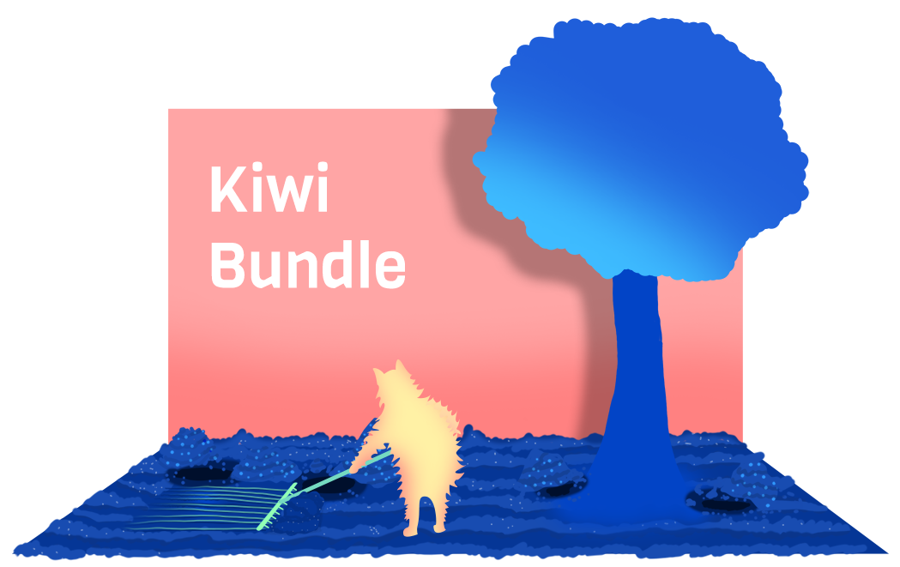

# Features
- out-of-the box configurations for [TypeScript](https://github.com/microsoft/TypeScript), [React](https://github.com/facebook/react), [React Native](https://github.com/facebook/react-native), [Babel](https://github.com/babel/babel) and [ESLint](https://github.com/eslint/eslint)
- integration of [react-native-web](https://github.com/necolas/react-native-web) for building **web**, **Android** and **iOS** apps with the same codebase
- **instant start-up** and **hot reloading** to see your components changes in real time
- only two NPM packages : one for development and one for distribution


# Getting started

## Requirements
You will need NodeJS to be installed : https://nodejs.org/en/download/

For Android builds, [Java](https://openjdk.java.net) and [Android Studio](https://developer.android.com/studio/index.html) are required

For iOS builds, you need to have Xcode installed on your Mac

Optionally you can install `yarn` in replacement of `npm` by running `npm install -g yarn`

Finally, if you do not have a text editor yet, give VSCode a try : https://code.visualstudio.com

## Install
Create a **./package.json** file :
```json
{
  "name": "kiwibundle",
  "version": "1.0.0",
  "kiwi": {
    "android": {
      "package": "cc.blueforest.kiwibundle",
      "build": 1
    },
    "ios": {
      "build": 1
    }
  },
  "scripts": {
    "start": "kiwi start",
    "build": "kiwi build"
  },
  "dependencies": {
    "kiwi-bundle": "4.6.1-8"
  },
  "devDependencies": {
    "kiwi-bundle-dev": "4.6.1-8"
  },
  "browserslist": {
    "production": [
      ">0.2%",
      "not dead",
      "not op_mini all"
    ],
    "development": [
      "last 1 chrome version",
      "last 1 firefox version",
      "last 1 safari version"
    ]
  }
}
```

Then run `npm install` or `yarn install`


## Commands

### Web
To start a local server, run `npm run start web` or `yarn start web`

To build static files, run `npm run build web` or `yarn build web`

### Android
To start development environment :
1. Run `npm run start metro` or `yarn start metro`
2. Run `npm run start android` or `yarn start android`

To build production files, run `npm run build android` or `yarn build android`

### iOS
Before your first start, you will need to run `pod install` in `./ios` to install CocoaPods dependencies

Then run `npm run start ios` or `yarn start ios`
